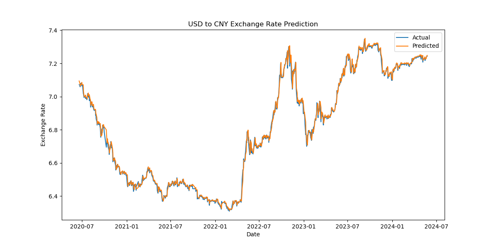
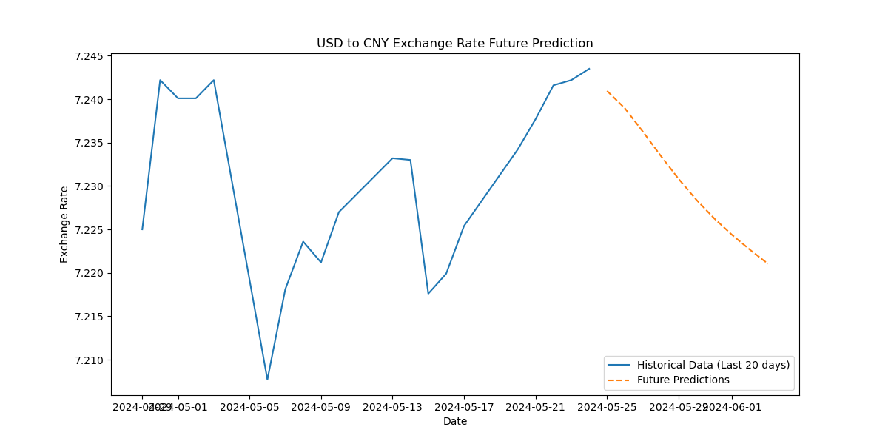

# Exchange-Rate-Forecasting-and-Predicting-with-LSTM

### Script explaination:

- GetAllData.py: Use Alpha Vantage API to get the exchange rate of USD/RMB from 2004 to now.
- GettingDataforTheDay.py: By using the API to update the new exchange rate information, it helps to update and maintain the dataset and project.
- LSTMPrediction.py: Train LSTM model with GridCV to find the best model through using the dataset we get above.
- LSTMPredictionPeriod.py: Use the best parameters to train the model and predict the exchange rate in future 10 days

### Result:
- Best parameters found:  {'batch_size': 64, 'epochs': 100, 'optimizer': 'adam', 'units': 100}
- Train Score: 0.012623310581419986 RMSE
- Test Score: 0.02037485337487071 RMSE

